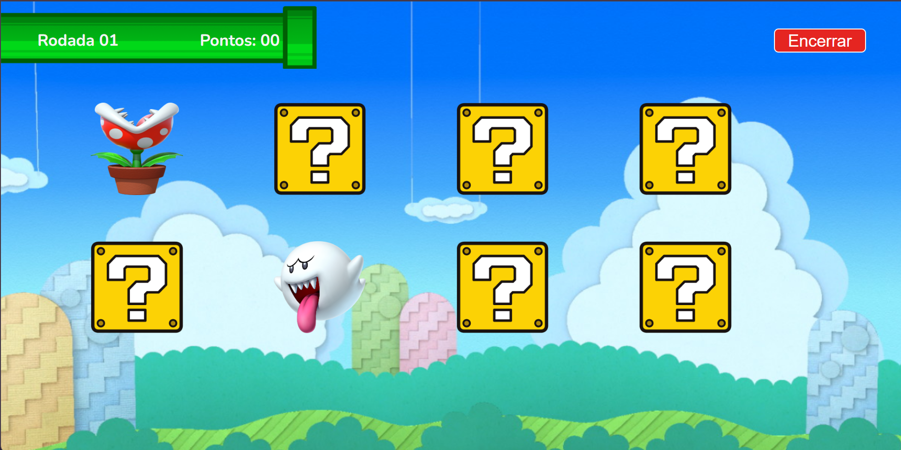

# 🧠 Jogo da Memória — Kenzie

Jogo da memória desenvolvido durante meus estudos de desenvolvimento web.

O objetivo é encontrar todos os pares de cartas no menor tempo possível, acumulando pontos durante a partida.

---

## 📸 Preview

  

  

---

## 💻 Sobre o projeto

Este projeto foi desenvolvido durante a maratona **Programar para Evoluir**, como parte dos meus estudos iniciais de desenvolvimento web.

A proposta foi criar um jogo da memória interativo utilizando HTML, CSS e JavaScript.

O projeto foi mantido no meu GitHub como registro da minha evolução e aprendizado na programação.

---

## 🛠️ Tecnologias utilizadas

- HTML5
- CSS3
- JavaScript

---

## ✨ Funcionalidades

- Jogo da memória com cartas
- Identificação de pares
- Interação através de cliques
- Sistema de pontuação
- Interface temática

---

## 🚀 Acesse o projeto

🔗 [Jogar online](https://luutsuk.github.io/jogo-da-memoria-kenzie/)

💻 [Ver código no GitHub](https://github.com/LuuTsuk/jogo-da-memoria-kenzie)

---

## 📚 O que pratiquei

- Estruturação de páginas com HTML
- Estilização utilizando CSS
- Manipulação de elementos com JavaScript
- Eventos de clique
- Lógica de programação
- Desenvolvimento de interfaces interativas

---

  Desenvolvido durante meus estudos de programação. 💜

